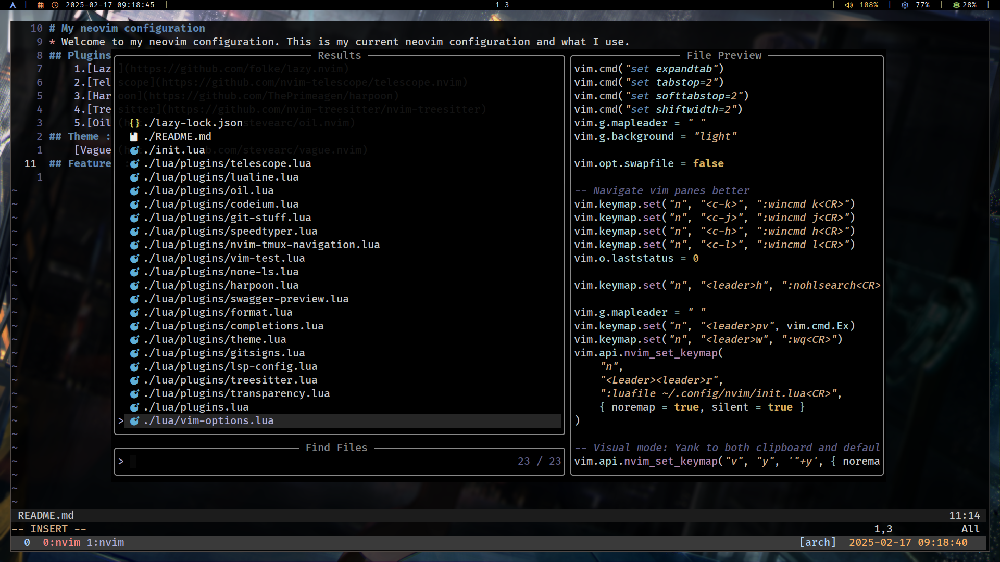
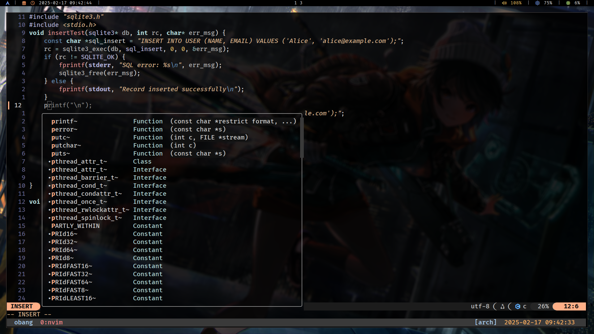

# My Neovim Configuration

Welcome to my Neovim configuration. This is my current setup and the plugins I use.

## UI




## Plugins
1. [Lazy](https://github.com/folke/lazy.nvim)
2. [Telescope](https://github.com/nvim-telescope/telescope.nvim)
3. [Harpoon](https://github.com/ThePrimeagen/harpoon)
4. [Treesitter](https://github.com/nvim-treesitter/nvim-treesitter)
5. [Oil](https://github.com/stevearc/oil.nvim)

## Theme
- [Vague](https://github.com/stevearc/vague.nvim)

## Features
- Auto completion
- Auto formatting
- Great LSP support

## Prerequisites
- **Clangd**
- **gopls**
- **rust_analyzer**
- **node**

## Installation

1. Install [Neovim](https://github.com/neovim/neovim).
2. Install necessary dependencies:
   - [Clangd](https://github.com/clangd/clangd)
   - [rust_analyzer](https://github.com/rust-analyzer/rust-analyzer)
   - [Node.js](https://nodejs.org/en/download/)
   - [gopls](https://github.com/golang/tools/tree/master/gopls)
3. Clone this repository into your home folder:

   ```bash
   git clone https://github.com/tsdios/nvim.git ~/.config/nvim

